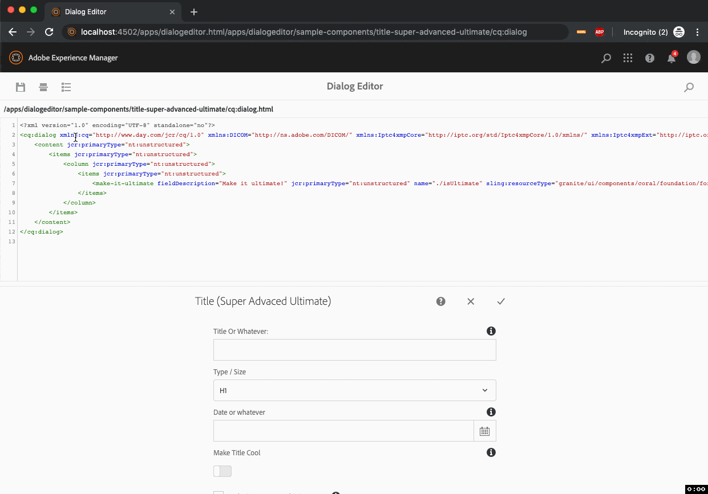
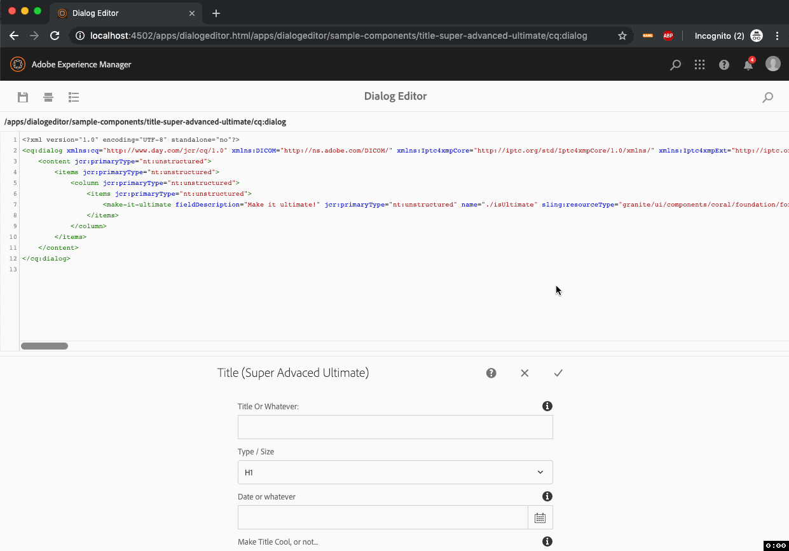

# AEM Dialog Editor

A REPL for AEM Dialogs!

## Features

### Component Dialog SuperType Lookup and Update

take a look at [src/main/content/jcr_root/apps/dialogeditor/sample-components](src/main/content/jcr_root/apps/dialogeditor/sample-components) and see the `sling:resourceSuperType` of each component.




### Dialog Search

Will search for dialogs under `/apps` to be edited with the Dialog Editor



## Quick start

- Download and Install latest from [release page](https://github.com/ahmed-musallam/AEM-Dialog-Editor/releases)
- Navigate to the sample component: [http://localhost:4502/apps/dialogeditor.html/apps/dialogeditor/sample-components/title-super-advanced-ultimate/cq:dialog](http://localhost:4502/apps/dialogeditor.html/apps/dialogeditor/sample-components/title-super-advanced-ultimate/cq:dialog)

## Build and Deploy from source

```sh
./gradlew
```

## Environment

Tested on:

* Java 1.8
* Gradle 5.0
* Adobe AEM 6.5

