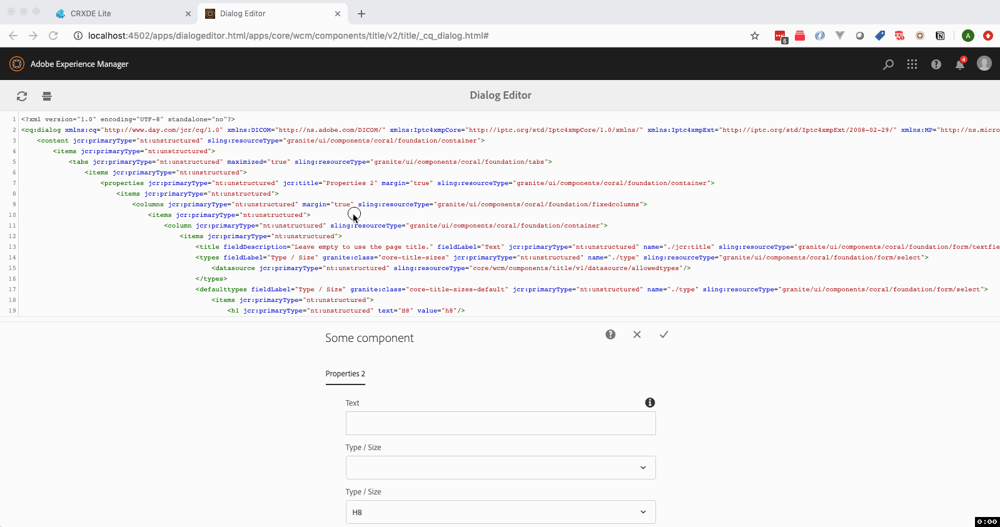

# AEM Dialog Editor

A code editor, in browser for dialogs!

## Description

This project could be used to start developing **application** based on AEM.

## deploy

```sh
./gradlew
```

## Environment

Tested on:

* Java 1.8
* Gradle 5.0
* Adobe AEM 6.5

## Building

1. Install Gradle
    * Use bundled wrapper (always use command `gradlew` instead of `gradle`). It will be downloaded automatically (recommended).
    * Use standalone from [here](https://docs.gradle.org/current/userguide/installation.html).
2. Run `gradlew idea` or `gradlew eclipse` to generate configuration for your favourite IDE.
3. Build application and deploy using command: `gradlew` <=> `:aemSatisfy :aemDeploy :aemAwait`

## Tips & tricks

* To run some task only for subproject, use project path as a prefix, for instance: `gradlew :aem:app.design:aemSync`.
* According to [recommendations](https://docs.gradle.org/current/userguide/gradle_daemon.html), Gradle daemon should be: 
    * enabled on development environments,
    * disabled on continuous integration environments.
* To see more descriptive errors or want to skip some tasks, see command line [documentation](https://docs.gradle.org/current/userguide/command_line_interface.html).

## Running tests 

### IntelliJ

Certain unit tests may depend on the results of running gradle tasks. One such example is the testing of OSGi Services using [OSGi Mocks](https://sling.apache.org/documentation/development/osgi-mock.html) where in order to run a test, the SCR metadata must be available for a class. Running a test like this in IntelliJ results in errors because the IDE is not aware of the Bundle plugin.

This can be worked around by configuring IntelliJ to delegate test execution to Gradle. In order to set this up, go to _Settings > Build, Execution, Deployment > Gradle > Runner_ and set your IDE to delegate IDE build/run actions to Gradle. Alternatively, you can use a dropdown menu to use a specific runner or to decide on a test-by-test basis.
