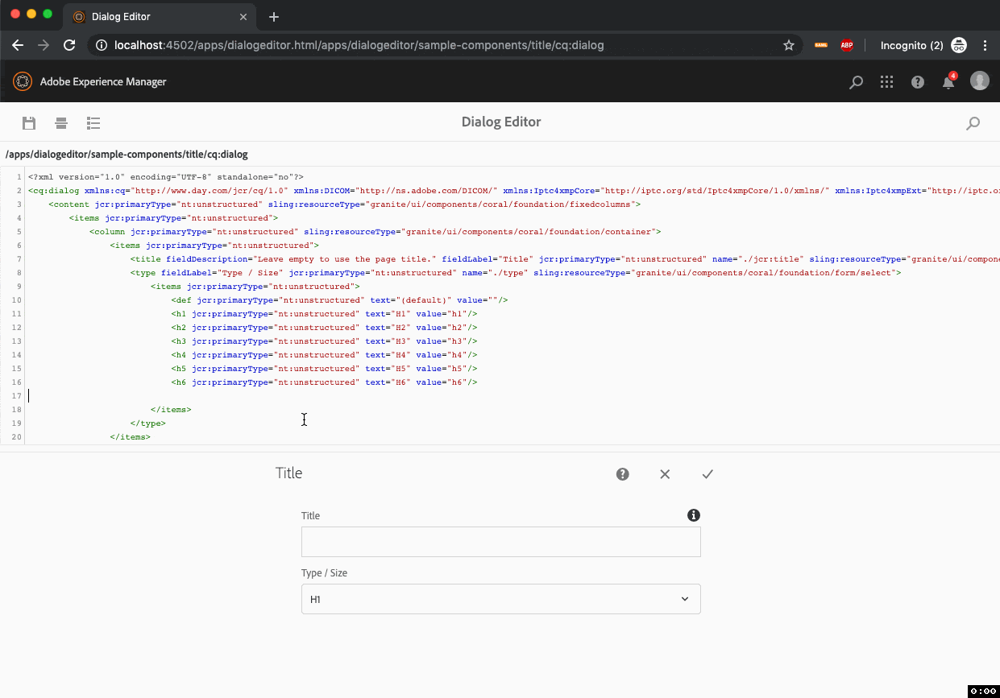

# AEM Dialog Editor

A REPL for AEM Dialogs!

## Features

### Component Dialog SuperType Lookup and Update

take a look at [src/main/content/jcr_root/apps/dialogeditor/sample-components](src/main/content/jcr_root/apps/dialogeditor/sample-components) and see the `sling:resourceSuperType` of each component.


### Dialog Search

Will search for dialogs under `/apps` to be edited with the Dialog Editor


## build and deploy

```sh
./gradlew
```

## Environment

Tested on:

* Java 1.8
* Gradle 5.0
* Adobe AEM 6.5

